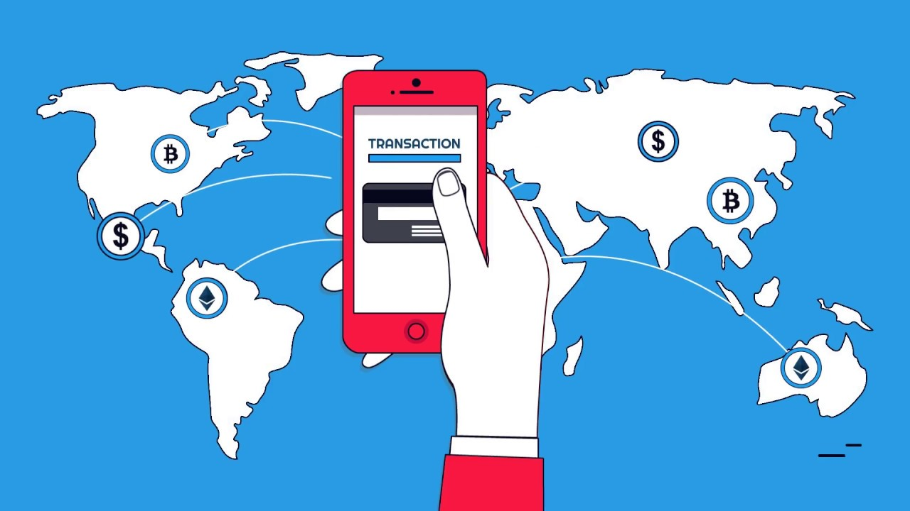
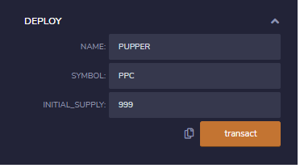
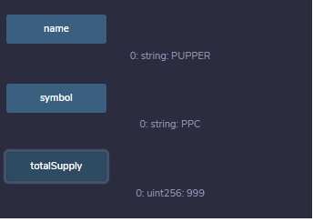
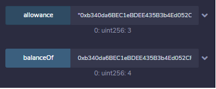
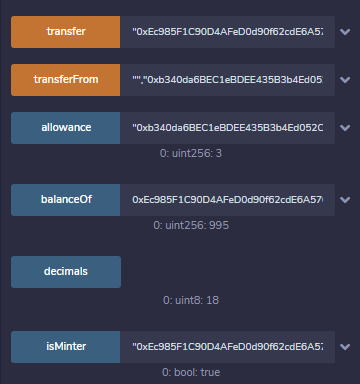
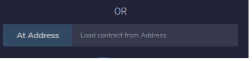

# Unit 21: PupperCoin Crowd Fund	

In this exercise we will demonstrate how to create a contract that will allow the creation and sale of a token similar to a crypto currency. There will be a start time, end time, coin cap and target raise goal built into the contract. These are actually very important features and prevents abuse. We will be deploying this on the *Kovan test network.*

In our example we are going to have the Opening Sale start at the moment of contract deployment. so `now` will be used. The closing period will be 24 weeks after launch and will be represented with `now+24 weeks`.

TOKENS can be divided up into smaller units exactly like wei. A 1 with '18' Zeroes is equal to 1 ETH. This is also the case for our Token bits ( TKNbits ). We are going to set our cap at 999 TKNs ( so 999 with '18' zeroes!). Our Goal will be just the sale of 10 coins. If this goal isn't met by the 24 week mark the contract defaults and returns all the money to all spenders!

## Function and Features

  This solidity contract will include the function to mint new coins, approve the transfer of coins between address, simple send from one account to another, balance checking, assigning addresses for minting, revoking minting rights as well as checking the total supply of tokens ( Pupper Coins ) in circulation.

We will be using an OpenZepplin github repository so that our Token can take on many sophisticated features such as ERC standards and the allowance of all the above functionality mentioned.

https://github.com/OpenZeppelin/openzeppelin-contracts/blob/release-v2.5.0/contracts

https://github.com/OpenZeppelin/openzeppelin-contracts/blob/release-v2.5.0/contracts/token/ERC20/ERC20.sol";

In order to deploy our contract we will need 3 fields filled. All these are arbitrary but we will be using the values below.

Deployed onto Kovan under : 0x23d0472dfE2570Dd5c1F23559CdCb115Eb9fD1DC

Since we declared these variables public we have access and can see their values.

We can also check Balances and Allowances:

* note that you do not need to own the account to see their balance, just need the their wallet address.

I gave my main address the majority of the coins for easy distribution.

"0xEc985F1C90D4AFeD0d90f62cdE6A570E986Cf4aa"

You need to grant approval and define Allowances for address and amounts for transfers to occur.

A record of my main address interacting with contracts on kovan is below.

https://kovan.etherscan.io/address/0xec985f1c90d4afed0d90f62cde6a570e986cf4aa

Here is just the contract itself:

https://kovan.etherscan.io/address/0x23d0472dfE2570Dd5c1F23559CdCb115Eb9fD1DC

If you compile the provided code within remix.ethereums IDE and insert the contract hash in the provided fields you can check the balances yourself.

This concludes our exercise! This is a great example of how contracts can be deployed to automatically moderate a type of security! This contract and balance of pupper coins will be forever etched into Kovans Blockchain!
