# Proof Of Authority BlockChain using GETH

Outside sources used:

* https://hackernoon.com/setup-your-own-private-proof-of-authority-ethereum-network-with-geth-9a0a3750cda8
* https://medium.com/@prashantramnyc/how-to-set-up-a-multi-node-private-ethereum-blockchain-from-scratch-in-20-mins-or-less-e0d7e091e062
* https://around25.com/blog/build-private-ethereum-blockchain-geth/

We will be setting up a "Proof of Authority" Blockchain. This requires us to name unlock\sealer accounts for the "Authority". The Main steps will be:

* Accounts\Keystores ( MyCrypto )

* Genisys Block creation - .json file ( Puppeth )

* Node Initialization ( Geth )

* Node startup ( Geth )

* Custom Network Configuration ( MyCrypto )

* Checking Wallet funds

* Transaction ( MyCrypto )

  

## Step 1 Account and Keystore Creation using 'MyCrypto'

In this section we will create a keystore file. This is a encrypted file that represents a wallet. This means that you will have to set and remember a password for this keystore. We will make 2 of them, one for each of our 2 nodes.

Open up 'MyCrypto' and choose "Create New Wallet"

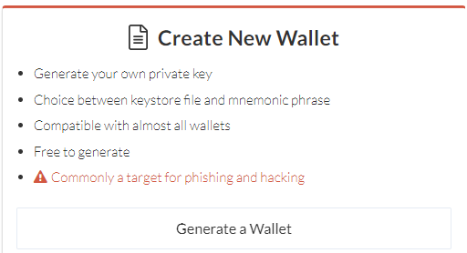

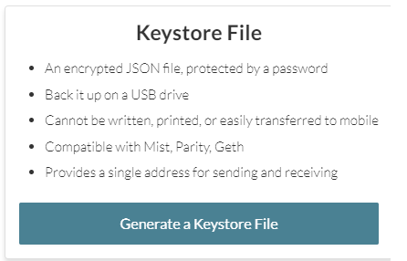

Make sure you write the passwords down for each keystore. They can be the same for each one to make it easier.

Example of Keystore file name: UTC--2020-05-20T16-32-08.056Z-...

Save both of these someplace. We will be needing these later.

## Step 2 Generate .json for Genesis Block ( puppeth )

In this step we will be using the puppeth tool to configure then export a .json file which we will use to initializes our nodes and create the first block known as the Genesis Block.

After running puppeth it will prompt you with the following questions:

* `Please specify a network name to administer (no spaces, hyphens or capital letters please)`

> authnet 

Choose "2": "Configure new Genesis", 

then "1": "Create Genesis from Scratch", 

then "2": "Proof Of Authority"

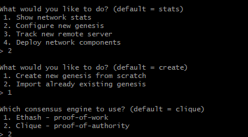

It will ask you for 2 addresses to seal. These accounts are the ones we created as keystores earlier. Their addresses are located inside the files as clear text.

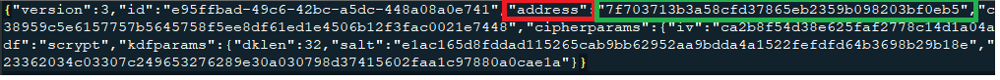

It will also ask you which accounts to prefund. List the same ones you entered to 'seal' as well. This will just make it easier for us.

It will ask to prefund, go ahead and say "Yes"

It will ask you to specify a chain ID. i recommend using an ID that is at least 4 digits as there are reserved chain IDs for well known networks. We choose a chainID of '3333'. This will be written into the .json file later but I recommend writing this down.

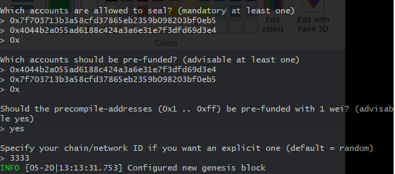

The last part of Puppeth is exporting the genesis. It will take you to a new menu with 4 options. Choose 2, "Manage Existing genesis", 

then "2", "Export Genesis configurations"

When it asks which folder, just hit enter again and it will save it down into your terminals working directory.

* *its ok to get the two errors regarding Aleth and Parity Chain specs*

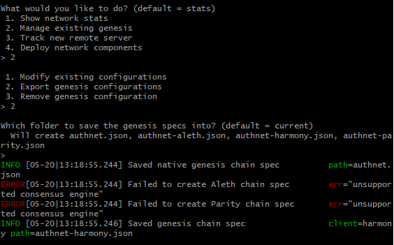

We named our network authnet so we are interested in the 'authnet.json'. They rest of the files can be deleted.

I created a folder named "authnet" which will be the top level for all of our geth blockchain files. Put our authnet.json at the root of our toplevel directory authnet. Inside the authnet folder create 2 folders ; 1 called node1 and another node2. Create a Keystore folder in each node folder and stick both of our keystore files we generated in step1 ( the files that look like "UTC--2020-05-20T16-32-08.056Z-...")

authnet

​		├───node1
​		│   └───keystore
​		└───node2
​		    └───keystore

Now we need to edit the authnet.json so that both of our accounts we created earlier will have funds in them. Open up the authnet.json with a text editor and look for our two addresses that represent our wallets. They will be listed at the very end of the file.

under the 'balance' section of each address change one of the zeros in the middle of that large number to a 1

 "balance": "0x2000000000000000000000000000*1*0000000000000000000000000000000000"

Save the file and close it. we are ready to use a geth command to generate the first block.

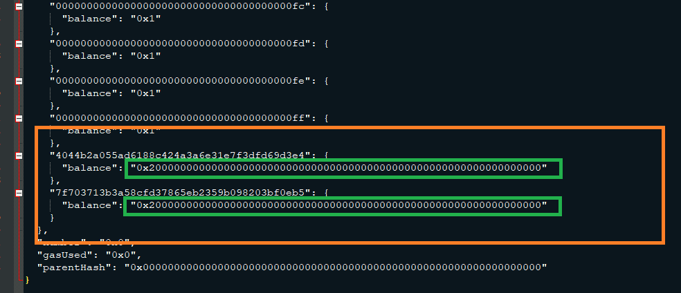

# Step 3 Initialize the nodes ,generate the first block

In this section we will initialize both nodes using the generated puppeth .json file from the previous step. I have created shell scripts to make this process repeatable. 

initnode1.sh:

`cd "$HOME\OneDrive\FinTechBootCamp\BlockChainHomework01\authnet"
geth init authnet.json --datadir node1
read -p "Press <ENTER> to close"`

initnode2.sh:

`cd "$HOME\OneDrive\FinTechBootCamp\BlockChainHomework01\authnet"
geth init authnet.json --datadir node2
read -p "Press <ENTER> to close"`

You should get a similar message when successfully initializing both nodes. In my example scripts i make sure i get to my root blockchain directory authnet before calling the geth command.

* if you need to undo this, just delete both "GETH" directories in each NODE folder ( Node1 and Node2 in our example )

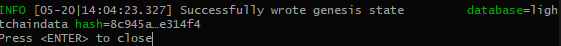

# Step 4 Starting the Nodes

In this section we will be starting the first node then the second. We will need info from the output window on the first node before we start the second. Again, i have created shell scripts to make this process repeatable.

StartAuthnetNode1.sh:

`cd "$HOME\OneDrive\FinTechBootCamp\BlockChainHomework01\authnet"
geth --datadir node1/ --syncmode 'full' --port 30311 --rpc --rpcaddr 'localhost' --rpcport 8545 -unlock '0x7f703713b3a58cfd37865eb2359b098203bf0eb5' --password pw.txt --mine --allow-insecure-unlock --ipcdisable
read -p "Press <ENTER> to close"`

The first line in the shell script makes sure we are in the right directory. The second line is a long one with many parameters. The first part -`--datadir node1/` the data directory of the node we are using. `--rpc` this allows communication to happen to the node itself. `--rpcport 8545` this is default but i like to be explicit whenever I can. The `--unlock` param specifies the wallet public address hash. We used the first one we created from step1. The `--password pw.txt` line gets the password from a text file we have sitting in the root of our 'authnet' folder. *Make sure you have a carriage return after the password in that text file!*  `--mine` is necessary to progress the blockchain and record any transactions being made. `--allow-insecure-unlock` and `--ipcdisable` might be windows specific and make it easier to show our example.

Running this script should give us output with an enode value we NEED for the second node:

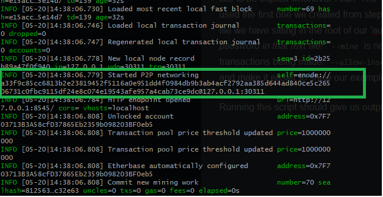

This will allow us to create the script to start the second node. Here is what mine looks like after grabbing the enode information from launching the first node:

`cd "$HOME\OneDrive\FinTechBootCamp\BlockChainHomework01\authnet"
geth --datadir node2 --port 30304 --unlock "4044b2a055ad6188c424a3a6e31e7f3dfd69d3e4"  --bootnodes "enode://a33f9c85cc6813b2e23819452f5116a0e951dd4f0984db9b3ab4acf2792aa385d644ad840ce5c26506731c0fbc9115df24e8c074e19543afe957a4cab73ce9dc@127.0.0.1:30311"  --password pw.txt --ipcdisable --mine
read -p "Press <ENTER> to close"`

Running these scripts from a file have the advantage of being able to easily start and stop the nodes. You should get a *consistent* "peercount=1" message on both node windows if they are communicating with each other. Keyword is Consistent since they tend to report a peer even when they do not see one and vice versa but never seemingly consistently.

# Step 5 Creating a custom network config(MyCrypto)

Open MyCrypto and select "Change Network" and create a new network with the info provided in the pictures below. In my example I used 'authnet' this can be any name you choose.

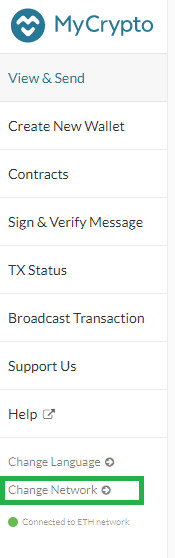

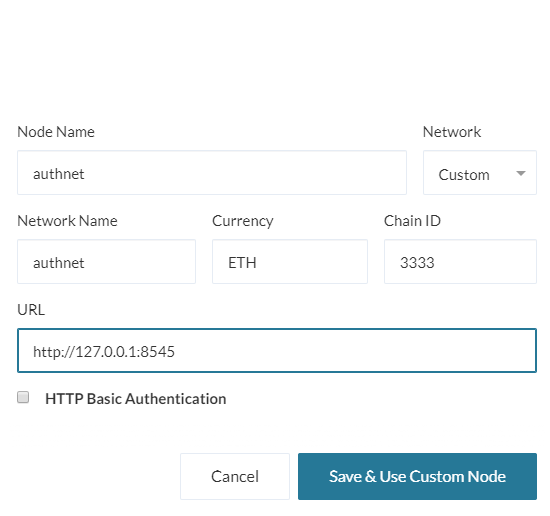

The MyCrypto application will attempt to connect to your existing Node Network. If it is successful you will see the message at the bottom left; "Connected to ETH Network"

# Step 6 Checking wallet funds

In this second we will view our wallets designated by the keystores we created in part 1. MyCrypto should be connected to our running blockchain for this to work. 

Select "View & Send" within MyCrypto at the top left, then click Select wallet file. Remember the keystore files should be under the Node1/Keystore and Node2/Keystore respectively. It will require the password we set earlier( same as the one in the pw.txt ).

If everything is working correctly you should see funds within mycrypto for both accounts. It will look something like below;

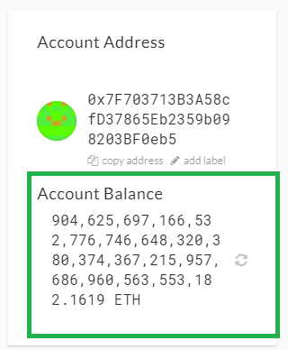

# Step 7 Sending a transaction

In this last and final step we will send Ether from one account to another using the second public address. Once you have opened up the first wallet within MyCrypto, select send ether from the drop down list. It may already be selected:

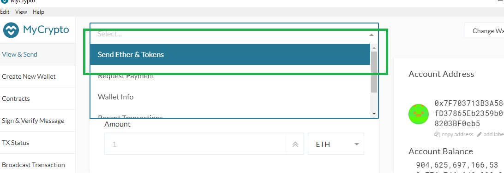

Input in the OTHER public address of the second wallet, send some ether ( in my case i did 23  ), then select " SEND TRANSACTION".

You should get a green success message within mycrypto at the bottom:

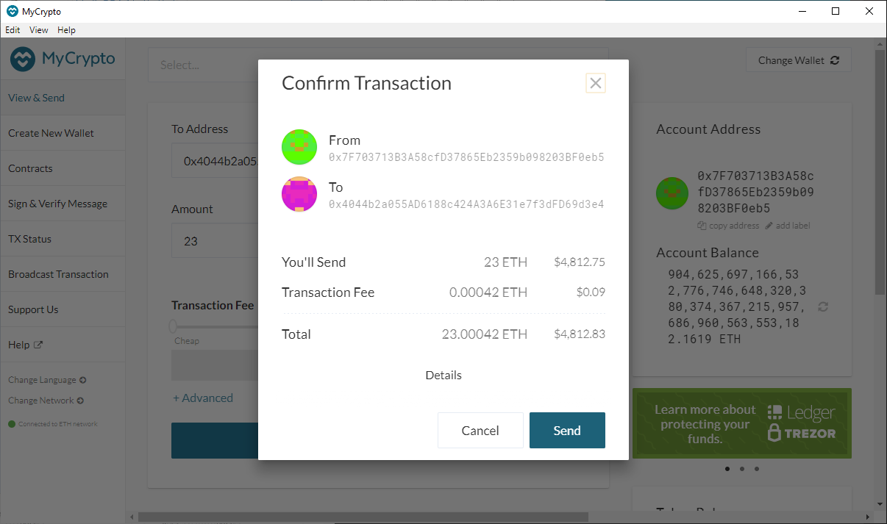

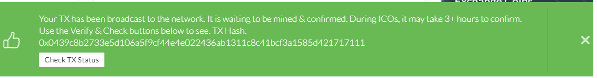

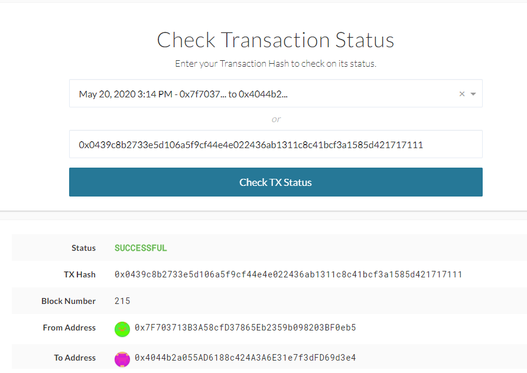

Success! The nodes have recorded your transaction\s. If you remove the Geth folders from the NODEs directory this will reset the block chain. You can reinitialize and start from scratch if you like.

