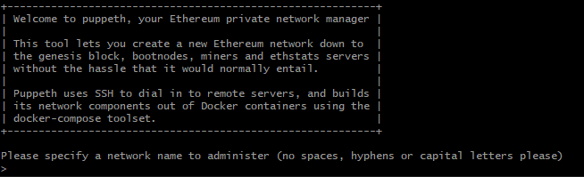
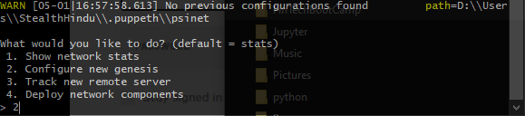
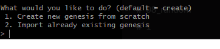
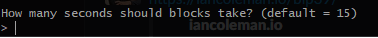

Setting up a PoA block chain using PUPPETH, GETH and MyCrypto

I used some sources in addition to the Columbia Fintech materials. I was unable to complete the assignment with the given instruction. I searched

Sources:

* https://hackernoon.com/setup-your-own-private-proof-of-authority-ethereum-network-with-geth-9a0a3750cda8
* https://medium.com/@prashantramnyc/how-to-set-up-a-multi-node-private-ethereum-blockchain-from-scratch-in-20-mins-or-less-e0d7e091e062
* https://around25.com/blog/build-private-ethereum-blockchain-geth/

## Step 1 Genisys Blocks and Accounts

Specify network name. I went with 'psinet'



Choose 2 to create our new genesis block



Create from Scratch:



i left it default '15'



So we have network name: psinet

## Step 2 Creating the two nodes

Commands:

geth --datadir $HOME/Documents/Geth/psinet/node1/ account new


Save Genesis specs

all node files are here:  $HOME/Documents/Geth/psinet/

- future commands need to be run from this directory so that the proper blockchain is specified.

==========================

## Step 3 Initializing the nodes

initialize nodes:

your working directory needs to be in the same folder as the nodes

```
geth --datadir node1/ init psinet.json
geth --datadir node2/ init psinet.json
```

You should get this message from the above commands!

Successfully wrote genesis state         database=lightchaindata hash=93d216…fa2440

Successfully wrote genesis state         database=lightchaindata hash=93d216…fa2440

After all steps above have been taken this is what your blockchain directory should look like.

cmd //c tree   ( this is a windows tree bash equivalent command)

▒▒▒▒node1
▒   ▒▒▒▒geth
▒   ▒   ▒▒▒▒chaindata
▒   ▒   ▒▒▒▒lightchaindata
▒   ▒▒▒▒keystore
▒▒▒▒node2
    ▒▒▒▒geth
    ▒   ▒▒▒▒chaindata
    ▒   ▒▒▒▒lightchaindata
    ▒▒▒▒keystore
(base)


Notes:

BOOTNODE COMMAND:

bootnode -nodekey boot.key -verbosity 9 -addr :30310

enode://b6fee01a250b94dd587bf84d9ea81908b4683a3dd13193515a656a45898ce2eaf43eb63b1c6a4420704173bcfb14bb607d672ed7d1aabb9c0bde6c58e7037ae8@127.0.0.1:0?discport=30310

## Step 4 starting the nodes

==================

Running the Nodes

=====================

Make sure you are in the proper directory with NODE to run

Open up a gitbash(windows) and make sure you are in proper blockchain dir.

Node1 Command: geth --datadir node1 --mine --minerthreads 1

Node2 Command (in second window):

geth --datadir /node2 --port 30304 --rpc --bootnodes "enode://fbfd6d13ed99b9c1b2dcf6d2100c4d4a405404a1a27d25eae2442e1ad5859baf091cfd65a4bb1c960a135b2d821a6b671d392b18ce48a75aa0868e7f6550a3d3@127.0.0.1:30303" --password node2/password.txt --ipcdisable


If successfully running both nodes you should see a similar line like this on second window!

INFO New local node record - seq=9 id=e05980935ee5191f ip=67.245.1.222 udp=30304 tcp=30304

Second block will show successful block sync,chain index upgrade and new local record 


### TEST CODE:

```
geth --datadir node1/ --syncmode 'full' --port 30311 --rpc --rpcaddr 'localhost' --rpcport 8501 --bootnodes 'enode://b6fee01a250b94dd587bf84d9ea81908b4683a3dd13193515a656a45898ce2eaf43eb63b1c6a4420704173bcfb14bb607d672ed7d1aabb9c0bde6c58e7037ae8@127.0.0.1:30311' --networkid 1515 --gasprice '1' -unlock '0x115bFf4c44aC61DAf9D37c2AC6b1CE3CEdc93532' --password node1/password.txt --mine --allow-insecure-unlock --ipcdisable
```

```
geth --datadir node2/ --syncmode 'full' --port 30312 --rpc --rpcaddr 'localhost' --rpcport 8502 --bootnodes 'enode://b6fee01a250b94dd587bf84d9ea81908b4683a3dd13193515a656a45898ce2eaf43eb63b1c6a4420704173bcfb14bb607d672ed7d1aabb9c0bde6c58e7037ae8@127.0.0.1:30312' --networkid 1515 --gasprice '0' --unlock '0x6f5Aa1E06Ee74697d41316be16067c2763aBFd8F' --password node2/password.txt --mine --allow-insecure-unlock --ipcdisable
```

### END TEST CODE


My crypto wallet new connection

- this wasted hours of my time figuring out. - http://127.0.0.1:8485

DO NOT USE HTTPS:// LIKE THE GREYED OUT TEXT IN MYCRYPTO. must be just http. NOT with 's'

If successful it will turn green bottom left with "Connected to ETH Network"


I used a keystore and password when opening up both my accounts

Choose the keystore and unlock the account.


The Balance set in the Gensis block shows the prefunded addresses.


* sending ethereum via MyCrypto seemed very inconsistent. it worked sometimes and others it failed. I was unable to consistently recreate the issues every time.
