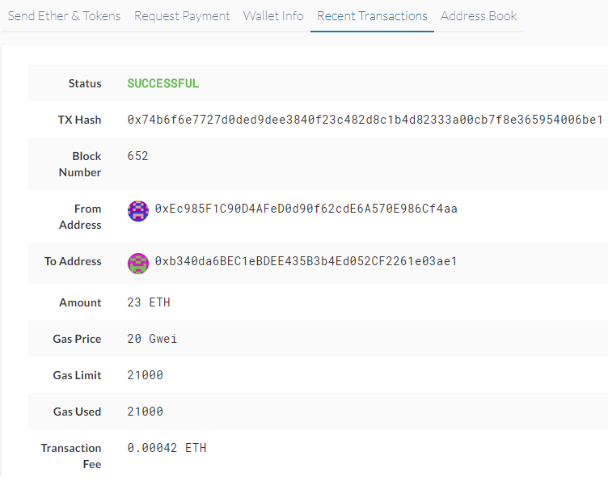

# Multi-Blockchain Wallet in Python


Using what we have learned with blockchain so far, we will;

* Create a tool to derive wallets ( sending and receiving ) for Ethereum and BTC Testnet
* Send Money from given address to given second address
* Record a log with transaction information.


## Creating a tool to derive wallets

### PHP HD-DERIVE

We will be using a php tool within our python script called "HD-WALLET-DERIVE"

Github repository here: https://github.com/dan-da/hd-wallet-derive

You need to have php installed before cloning the repository and running the following commands;

Windows installation:

`git clone https://github.com/dan-da/hd-wallet-derive
 cd hd-wallet-derive
 php -r "readfile('https://getcomposer.org/installer');" | php
 php -d pcre.jit=0 composer.phar install`

We will be calling this within our python. You can test to make sure it is working properly by navigating to the hd-wallet-derive.php file within gitbash and calling the below command:

`./hd-wallet-derive.php -g --key=xprv9tyUQV64JT5qs3RSTJkXCWKMyUgoQp7F3hA1xzG6ZGu6u6Q9VMNjGr67Lctvy5P8oyaYAL9CAWrUE9i6GoNMKUga5biW6Hx4tws2six3b9c --numderive=3 --preset=bitcoincore --cols=path,address --path-change`

This should output some wallet information if it is working properly.

### PYTHON portion of Derive

Here is my python function that uses the PHP derive function and creates a dictionary which represents wallets within python. You just need to make sure the function can see the folder and .php file:

`import subprocess`
`import json`

`def deriveWallets(coinType, numWallets, mnemonic):
	phpAndParams = f'php hd-wallet-derive-master\hd-wallet-derive.php --mnemonic="{mnemonic}" --		numderive="{numWallets}" --coin="{coinType}" --format=json -g' 
    proc1 = subprocess.Popen(phpAndParams, shell=True,stdout=subprocess.PIPE)
    (output, err) = proc1.communicate()
    keyDicts = json.loads(output)
    return keyDicts`

coinType will be either 'etc' or 'btc-test' for our examples

numWallets is the number of wallets we need. 2 is a good number so we have a sender and receiver

mnemonic is the 12 word mnemonic that is common with deriving many crypto wallets. Provide 12 words within the BIP39,44 standard with a space betweem them as a string.


## Sending and Receiving

We are going to create a top level function that, when given a: 

​	coin type  , from account , to address, amount

will execute a transaction.

We will do this for ETH on our local Proof of authority block chain, and also one for BTC-TEST net on a public testnet.

Here is our top level function. We will call this when using the wallet.py from the command line or from another script. The main purpose is to check the coin type since the transaction commands vary for BTC-TEST and ETH

`def create_trx(account, to, amount,coin):
    if coin == ETH:
        return create_eth_tx(account,to,amount)
    elif coin == BTCTEST:
        return create_btc_tx(account, to, amount)`


Here is how I got our 4 wallets ( 2 eth and 2 btc)

`def priv_key_to_account(coin, priv_key):
    if coin == ETH:
        return Account.privateKeyToAccount(priv_key)
    if coin == BTCTEST:
        return PrivateKeyTestnet(priv_key)`

`ETH_account_0 = priv_key_to_account('eth', ETHKeyDict[0]['privkey'])
ETH_account_1 = priv_key_to_account('eth', ETHKeyDict[1]['privkey'])
BTC_account_0 = priv_key_to_account('btc-test', BTCKeyDict[0]['privkey'])
BTC_account_1 = priv_key_to_account('btc-test', BTCKeyDict[1]['privkey'])`

We now have 4 accounts, 2 for each.


For ETH:

This needs to be specified since we are connecting to our local PoA blockchain. Make sure its fired up and unlocked!

`w3 = Web3(Web3.HTTPProvider(os.getenv('WEB3_PROVIDER', 'http://localhost:8545')))`

`def create_eth_tx(account, recipient, amount):
    gasEstimate = w3.eth.estimateGas(
        {"from": account.address, "to": recipient, "value": amount}
    )
    return {
        "to": recipient,
        "from": account.address,
        "value": amount,
        "gas": gasEstimate,
        "gasPrice": w3.eth.gasPrice,
        "nonce": w3.eth.getTransactionCount(account.address) `

This will return a dictionary that serves as a transactional log. 

In the below example I have sent 23 ether from `0xEc985F1C90D4AFeD0d90f62cdE6A570E986Cf4aa`

to  `0xb340da6BEC1eBDEE435B3b4Ed052CF2261e03ae1`





For BTC we will need to use a the public btc-test net. We use the 2 addresses from the derive function earlier. we have access to the address nd both private keys.

Using our btc-test address we can use the below link to send us some fake BTC for testing!

https://coinfaucet.eu/en/btc-testnet/

afterwards, we will use our btc send function to send BTC from the wallet we just funded to our second btc-test wallet

`create_btc_tx( BTC_account_0, BTC_account_1.address, .00006)`

BTC TX OUT:

```
'{"unspents":[{"amount":1962424,"confirmations":19,"script":"76a9140788e0c3fca37ac472754eef4bbe4af81c546b7a88ac","txid":"f3bf73dac1bea9a45dec0e2165cb84f6b576db9cfa58841fb107ace4eeae6cc4","txindex":1,"type":"p2pkh","vsize":148,"segwit":false},{"amount":1812196,"confirmations":571,"script":"76a9140788e0c3fca37ac472754eef4bbe4af81c546b7a88ac","txid":"0ebcabf1e6998d7e721b05660d729f9e733998a76e417f6dccd4a53c8ab28022","txindex":0,"type":"p2pkh","vsize":148,"segwit":false}],"outputs":[["n4AicaddUu2moAc9FroV3afQ4GsWRN135y",6000],["mgCnzr3MhDQBBTjmJusAGCWPdvy9Lmcc1A",3695316]]}'
```


using the 'txid' we can lookup the transaction on the public chain and see information like to address, from address and amount here:

​				https://tbtc.bitaps.com/


#### Included a jupyter version for testing and output recording as well as the wallet.py


