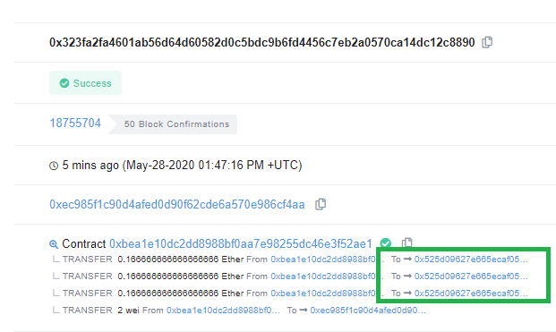
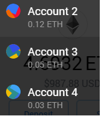
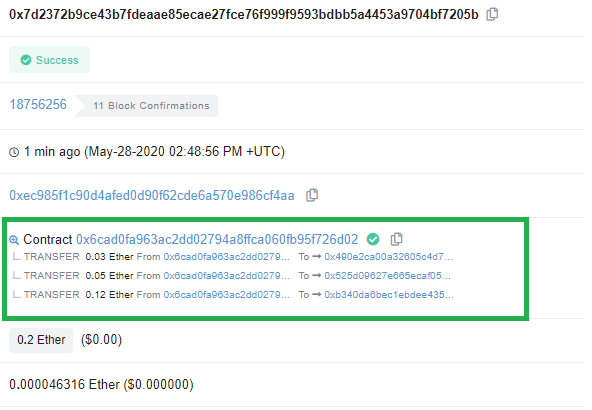
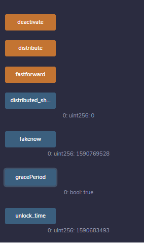
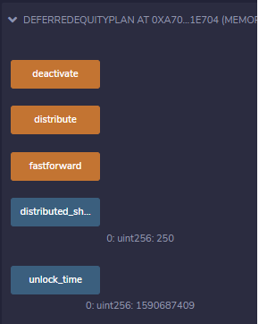

# Unit 20 - "Looks like we've made our First Contract!"

I used the Kovan Test network with all of these assignments.

​	Paying Public Address: 

​			0xEc985F1C90D4AFeD0d90f62cdE6A570E986Cf4aa

​	Additional Test Accounts for Deposits;

* 0xb340da6BEC1eBDEE435B3b4Ed052CF2261e03ae1
* 0x525d09627e665ecAf05DDF3010026B5486095a36
* 0x7a2f4A360b4728e31c252bC43099EEE7A38328D6

​	

## Associate Profit Splitter - { APS.sol }

Deploys a contract with 3 addresses listed then splits up an amount of ether evenly across the 3. I will then return any unspent ether to the contract callers address ( owner )

* Example with .05 being split within the contract.

  ​	https://kovan.etherscan.io/tx/0xcadcda8965b1e47fbc25db96a8f2dce493578896371f4ccdc421b526132448df

  

  

* Testing\ Hardening - works even if the same address is listed twice/thrice:

  ​	https://kovan.etherscan.io/tx/0x323fa2fa4601ab56d64d60582d0c5bdc9b6fd4456c7eb2a0570ca14dc12c8890!	

  

In conclusion; this is a very straightforward way to evenly split a payout and provide assurance and visibility to peers.

## Tiered Profit Splitter

The Tiered Profit splitter deposits the released ether in the contract based on percentages. Here we have 3 addresses where we will split it up using 3 percentages; 15%,25% then %60.

Using the below public addresses to test

* 0xb340da6BEC1eBDEE435B3b4Ed052CF2261e03ae1
* 0x525d09627e665ecAf05DDF3010026B5486095a36
* 0x490e2CA00A32605c4D7d8C1384D366Ee4880C1b0

Here is the transaction from etherscan. You can see that it deposited .03 ( 15% ), .05 ( 25% ), and .12 representing 60% of the total wei ( 200, 000, 000, 000, 000, 000 wei )

https://kovan.etherscan.io/tx/0x7d2372b9ce43b7fdeaae85ecae27fce76f999f9593bdbb5a4453a9704bf7205b

interesting note:

​	The cost of processing vs storage makes storing variables alternatively to processing math different. Remix can show the assembly language and it's gas cost comparison.

EX:

       amount = points * 15; // <----------------- This line can be removed if 60% calc below
       total += amount;
       employee_three.transfer(amount);
       //Emp 2 CTO 25%
       amount = points * 25;  // <----------------- This line can be removed if 60% calc below
       total += amount;        
       employee_two.transfer(amount);
       //Emp 1 CEO 60% 
       amount = points * 60;  // <---------- This line required if removing above two 'amount' tracking
       employee_one.transfer(msg.value - total); // ceo gets the remaining wei

In conclusion; this is just an advanced way to split out money ( from the above splitter ) based on given percentages.

## Deferred Equity Plan

​	In this assignment the contract will represent the employees "deferred equity incentive plan". For this example we will be testing it using REMIX's built in Java VM as opposed to a testnet blockchain. Once ready to deploy it can run on a testnet ( kovan ). 

For this exercise we will demonstrate paying out an incentive plan by emulating the passage of time. We won't use ether for this example but we will be keeping a tally in the "distributed_shares" variable.

We have two versions of the file; DEP.sol and DEP2.sol. DEP2.sol has additional functions and visibility to emulate the passing of time to ensure the contract works as expected. The "FastForward" function will simulate a passing of 1 year and 1 day ( 366 ). Afterwards Running the 'distribute' function should change the 'distribute_shares' variable to '250'. with each passage of time (fastforward) it will add 250, up to 1000. Afterwards, using the 'deactivate' will invalidate the contract and it will no longer check time or increment the distributed_shares var. The contract can be deactivated earlier before 'Distributed_shares' reaches 1000.

 

The below images are deployed "deferred equity plan" contracts. One with test and visibility, the other the bare minimum to function( production ). I also added a gravePeriod bool to indicate when the 'distribute' function should start adding share. Both images can be recreated using the DEP.sol and DEP2.sol included files.

 

This was defined just before the deconstructor in the contract

Fast Forward test function to be removed on in production contract

`function fastforward() public {
        fakenow += 366 days;
    }`

Searching the the public address for transactions you can find the test deployment of this contract.

https://kovan.etherscan.io/address/0xEc985F1C90D4AFeD0d90f62cdE6A570E986Cf4aa

Example of Test run below on EtherScan(Kovan Network). The errors were most likely due to double pressing some of the function buttons and queueing up a double run.

In conclusion one could deploy this type of contract to maintain ease of administration, visibility and record keeping. You could use the distributed shared value and use it to calculate an appropriate wei value ( `msg.value` )

